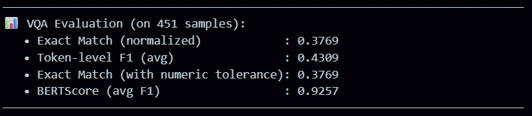
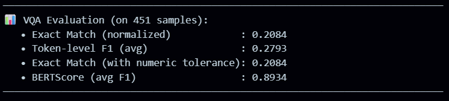

# Medical Vision-Language Model Fine-Tuning

This directory contains the complete fine-tuning pipeline, training scripts, evaluation results, and model artifacts for the MEDICO-AGENT vision-language models. Our work demonstrates the critical importance of training data ordering and composition for medical VQA tasks.

---

## 🎯 Overview

This project explores fine-tuning multiple vision-language models for medical Visual Question Answering (VQA) using Low-Rank Adaptation (LoRA) with the Unsloth library. Through systematic experimentation, we discovered that **the order and type of training data significantly impacts model performance** in medical domains.

---

## 🤖 Models Evaluated

### Model Comparison Summary

| Model | Base Architecture | Parameters | LoRA Rank | Alpha | Max Steps | Final Loss | Avg Loss |
|-------|------------------|------------|-----------|--------|-----------|------------|----------|
| **Qwen 8B Instruct** | Qwen 8B | 8B | 16 | 32 | 40 | 0.2119 | 0.4616 |
| **Qwen3-VL-2B-Instruct** | Qwen3-VL-2B | 2B | 16 | 32 | 40 | 0.2594 | 0.5055 |
| **Qwen2-VL-7B** | Qwen2-VL | 7B | 16 | 32 | 50 | 1.27 | 1.5580 |
| **Qwen-VL-2B-BNB-4bit** | Qwen-VL | 2B | 16 | 32 | 60 | 1.53 | 1.5879 |

---

## 🔍 Key Findings

### 🚨 Critical Discovery: Training Order Matters

**The order and type of training data significantly impacts model performance:**

- ✅ **Successful Strategy**: Training on **open-ended questions first** (descriptive VQA) → then closed-ended questions
- ❌ **Poor Performance**: Training directly on **closed-ended datasets** (Yes/No, Multiple Choice)

### Performance Issues with Closed-Ended Training

When models were fine-tuned exclusively on closed-ended datasets:
- Severely degraded performance on both open and closed-ended questions
- Poor understanding of medical terminology and disease concepts
- Significant hallucination issues
- Inability to generalize to unseen medical scenarios

### Success with Open-Ended Pre-training

After pre-training on open-ended VQA tasks:
- ✨ **Dramatic improvement** in overall performance
- Better comprehension of medical terms and disease relationships
- Reduced hallucination
- Strong performance on **both** open-ended and closed-ended questions during inference

---

## 📊 Dataset Information

### Initial Fine-Tuning Datasets (Models 1 & 2)

Combined dataset of **12,149 samples** from:
- `robailleo/medical-vision-llm-dataset`
- `ImageClef-2019-VQA-Med-Training`
- `alvinl29/medical-imaging-combined`

### Fine-Tuning Dataset (Models 3 & 4)

**PubMed Vision Dataset**: 6,666 data points

**Key Dataset Characteristics:**
- 🎯 Multiple images per question
- 📝 Rich, detailed explanations
- 🔄 Diverse medical imaging modalities
- 📚 Complex medical scenarios

**Why This Dataset Worked Better:**
1. **Multiple Images per Question**: Enabled better visual context understanding
2. **Detailed Explanations**: Provided rich semantic information
3. **Varied Perspectives**: Same concept shown from different angles/modalities
4. **Enhanced Generalization**: Model learned robust feature representations

### Evaluation Datasets

- **VQA-RAD**: 2,248 test samples (for Models 1 & 2: Qwen 8B Instruct and Qwen3-VL-2B-Instruct)
- **flaviagiammarino/VQA-RAD**: 451 test samples (for Models 3 & 4: Qwen2-VL-7B and Qwen-VL-2B-BNB-4bit)

---

## ⚙️ Fine-Tuning Configuration

### LoRA Hyperparameters

```python
lora_config = {
    "r": 16,                    # LoRA rank
    "alpha": 32,                # LoRA alpha
    "target_modules": [
        "q_proj", "k_proj", "v_proj", "o_proj",
        "gate_proj", "up_proj", "down_proj"
    ],
    "lora_dropout": [0.0, 0.01, 0.05],  # Varied by model
    "bias": "none",
    "task_type": "CAUSAL_LM"
}
```

### Training Configuration

```python
training_args = {
    "optimizer": "adamw_8bit",
    "learning_rate": 2e-4,
    "max_steps": [40, 40, 50, 60],  # Varied by model
    "warmup_steps": 5,
    "logging_steps": 1,
    "per_device_train_batch_size": 2,
    "gradient_accumulation_steps": 4
}
```

### Optimization Techniques

- **Unsloth**: Optimized LoRA implementation for faster training
- **4-bit Quantization**: BNB (Bits and Bytes) for memory efficiency
- **8-bit AdamW Optimizer**: Reduced memory footprint during training

---

## 📈 Results & Performance (VQA evaluation screenshots)

Below are the evaluation screenshots from each run (Exact Match (normalized), Token-level F1 (avg), Exact Match with numeric tolerance, and BERTScore (avg F1)):

### Model 1 — Qwen2-VL-7B (trained on 6,666 open-ended samples)
- Exact Match (normalized): **0.3769**  
- Token-level F1 (avg): **0.4309**  
- BERTScore (avg F1): **0.9257**  



---

### Model 2 — Qwen2-VL-2B (trained on 6,666 open-ended samples)
- Exact Match (normalized): **0.2084**  
- Token-level F1 (avg): **0.2793**  
- BERTScore (avg F1): **0.8934**  



---

### Model 3 — Qwen3-VL-8B (trained on ~12,149 closed-ended samples)
- Exact Match (normalized): **0.4590**  
- Token-level F1 (avg): **0.4929**  
- BERTScore (avg F1): **0.9479**  


---

### Model 4 — Qwen3-VL-2B (trained on ~12,149 closed-ended samples)
- Exact Match (normalized): **0.3503**  
- Token-level F1 (avg): **0.3798**  
- BERTScore (avg F1): **0.9436**  


---

> **Interpretation:** Model 3 (Qwen3 8B) achieved the highest Exact Match (0.4590). Models from the Qwen2 family (Models 1 & 2), trained on fewer open-ended samples, show lower EMs but still maintain good BERTScores, indicating semantic similarity even when exact matches differ. Increasing the open-ended training samples and following the recommended two-stage training order should help close the performance gap.

---

## 💡 Critical Insights

### Training Strategy Recommendations

1. **Always start with open-ended VQA training** to build foundational medical understanding
2. **Two-stage training order:** open-ended → closed-ended for best generalization.  
3. **Increase training samples for Qwen2 models** (from 6,666 → 12k+) to close the gap.  

## 📁 Directory Structure

```
Finetuning/
├── README.md                    # This file
├── scripts/
│   ├── train_model1.py         # Training script for Qwen 8B
│   ├── train_model2.py         # Training script for Qwen3-VL-2B
│   ├── train_model3.py         # Training script for Qwen2-VL-7B
│   └── train_model4.py         # Training script for Qwen-VL-2B-BNB
├── configs/
│   └── lora_config.yaml        # LoRA configuration files
├── evaluation/
│   ├── evaluate.py             # Evaluation scripts
│   └── metrics.py              # Metrics computation
├── Images/
│   ├── modelv1.png
│   ├── modelv2.png
│   ├── loss_train.png
│   └── train_loss.png
└── results/
    ├── model1_results.json
    ├── model2_results.json
    ├── model3_results.json
    └── model4_results.json
```

---

## 📚 References

- **LoRA**: [Low-Rank Adaptation of Large Language Models](https://arxiv.org/abs/2106.09685)
- **Unsloth**: [Optimized Fine-Tuning Library](https://github.com/unslothai/unsloth)
- **VQA-RAD**: Visual Question Answering in Radiology Dataset
- **PubMed Vision**: Medical imaging dataset from PubMed publications
- **Qwen Models**: [Qwen Model Family](https://huggingface.co/Qwen)

---

## 🔗 Integration with MEDICO-AGENT

The fine-tuned models from this directory are integrated into the main MEDICO-AGENT system through the `great_brain_specialist` tool. The agent uses these models for medical image analysis as part of its multi-tool workflow.

**Return to main documentation**: [`../README.md`](../README.md)

---

**⚠️ Medical Disclaimer**: These models are for research purposes only and should not be used for clinical decision-making without proper validation and regulatory approval.