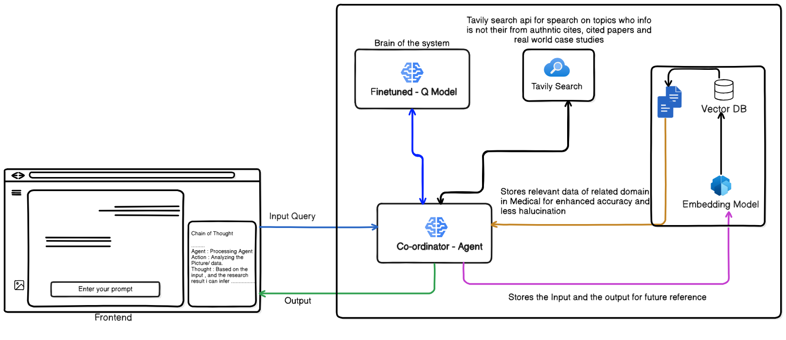

# MEDICO-AGENT — Medical Image Analysis

**MEDICO-AGENT** is a modular prototype designed for analyzing medical queries through text, images, or a combination of both. It integrates Groq's high‑speed LLMs API for agentic reasoning, fine‑tuned vision models for clinical text‑image interpretation (e.g., X‑rays, CT scans), a local RAG system for lung‑disease knowledge retrieval, and Tavily Search for web‑grounded medical facts. LangSmith provides full traceability and observability across the pipeline, making the system ideal for rapid prototyping in healthcare AI applications.

---



---

## Table of Contents

- [Quickstart](#quickstart-local)
- [API Endpoints](#endpoints)
- [Project Structure](#project-structure-important-files)
- [Fine-Tuned Vision Model](#fine-tuned-vision-model)

---

## Quickstart (local)

1. **Create a virtualenv and install dependencies:**

   ```bash
   python -m venv venv
   venv\Scripts\activate
   pip install -r requirements.txt
   ```

2. **Set environment variables** (or use a `.env` loader)

3. **Run the application:**

   **Option A: Gradio UI (Interactive Interface)**
   
   ```bash
   python gradio_app.py
   ```
   
   This launches an interactive Gradio interface where you can ask medical questions with or without images.

   **Option B: FastAPI Endpoint (API Server)**
   
   ```bash
   python main.py
   ```
   
   Then navigate to: `http://localhost:8000/docs` for the interactive API documentation

---

## Endpoints

### POST /chat (JSON)

**Request model**: `MedAge.schemas.QueryRequest`

- `question`: string
- `image_paths`: optional array of filesystem paths (strings)
- `session_id`: optional

---

## Project Structure (important files)

```
medico-agent/
├── MedAge/
│   ├── agent.py           # Graph workflow, prompts, and tool binding
│   ├── api.py             # FastAPI endpoints and upload handling
│   ├── config.py          # Paths, API keys, device settings
│   ├── multi_model.py     # Medical fine-tuned multi-modal helper
│   ├── rag.py             # RAG initialization / QA chain
│   ├── schemas.py         # Pydantic models for requests/responses
│   ├── tools.py           # Tool wrappers that the agent calls
│   └── utils.py           # Upload saving utility
├── Finetuning/            # Model training and evaluation
│   └── README.md          # Detailed fine-tuning documentation
├── Gradio_app.py          # Gradio interface for local testing
├── main.py                # FastAPI app entry point
├── requirements.txt
└── README.md              # This file
```

---

## Fine-Tuned Vision Model

The project utilizes a **Qwen-VL-based Vision-Language Model (VLM)** fine-tuned specifically for medical image analysis and Visual Question Answering (VQA) tasks. This adaptation enhances performance on descriptive (open-ended) and closed-ended (e.g., Yes/No, multiple-choice) medical queries by improving medical term comprehension, reducing hallucinations, and boosting generalization across imaging modalities like X-rays, CT scans, and MRIs.

### Model Overview

- **Base Model**: Qwen-VL variants (e.g., Qwen 8B Instruct, Qwen2-VL-7B, Qwen-VL-2B-BNB-4bit with 4-bit quantization for efficiency)
- **Fine-Tuning Technique**: Low-Rank Adaptation (LoRA) via the Unsloth library for memory-efficient training
- **Model Repository**: [Haider584/lora_model](https://huggingface.co/Haider584/lora_model) on Hugging Face

### Key Training Insight

**Critical Discovery**: Pre-training on **open-ended VQA** (descriptive questions) before closed-ended ones significantly improves performance. Direct closed-ended training leads to poor medical concept comprehension and high hallucination rates.

### Training Datasets

- **Initial Fine-Tuning**: 12,149 samples from `robailleo/medical-vision-llm-dataset`, `ImageClef-2019-VQA-Med`, and `alvinl29/medical-imaging-combined`
- **Advanced Fine-Tuning**: PubMed Vision Dataset with 6,666 data points featuring multi-image questions, rich explanations, and diverse modalities

### Evaluation Datasets

- **VQA-RAD**: 2,248 test samples
- **flaviagiammarino/VQA-RAD**: 451 samples

### Performance Highlights

The best-performing model (**Qwen 8B Instruct**) achieved:
- **50.35%** Overall Exact Match Accuracy
- **78.10%** Closed-ended Accuracy
- **78.93%** Closed-ended Precision

---

## 📖 Detailed Fine-Tuning Documentation

For comprehensive information about the model fine-tuning process, including:
- Complete model comparison and evaluation metrics
- Training configurations and hyperparameters
- Dataset preparation and preprocessing
- Loss curves and performance analysis
- Critical insights and lessons learned

**Please refer to**: [`Finetuning/README.md`](Finetuning/README.md)

